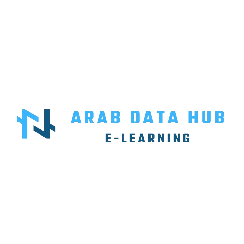
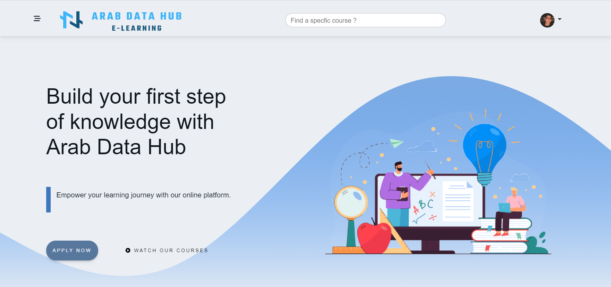

<p align="center">
  
</p>


Welcome to the Arab Data Hub eLearning platform project repository! This project is part of a Software Engineering course and focuses on creating an interactive and feature-rich eLearning platform. The platform is designed to cater to the needs of administrators, teachers, and students, providing a comprehensive environment for online education.

## 📝 Table of Contents

- [📝 Introduction](#introduction)
- [🔍 Features](#features)
- [💻 Technologies Used](#technologies-used)
- [🚀 Getting Started](#getting-started)
- [📘 Usage](#usage)
- [🛠️ Contributing](#contributing)
- [📄 License](#license)

## Home
<p align="center">
  
</p>

## 📝 Introduction

Arab Data Hub is an eLearning platform developed as a part of a Software Engineering course. The platform caters to the needs of administrators, teachers, and students, providing a robust and user-friendly environment for online education. It allows users to enroll in courses, access learning materials, communicate with peers, and more.

## 🔍 Features

### 🔍 Admin
- Accept or reject teacher requests
- Delete students, teachers, or admins
- Add admins
- Access analysis panels

### 📚 Teacher
- Add admins
- Create and manage courses
- Access analysis panels

### 👩‍🎓 Student
- Enroll in courses
- View course contents
- Add courses to the wishlist
- Chat with friends
- Add friends
- Search for courses or filter by category

## 💻 Technologies Used

The Arab Data Hub eLearning platform leverages a diverse set of technologies to ensure a seamless and robust user experience:

-  **PHP:** A server-side scripting language widely used for web development. PHP handles backend logic and interacts with databases to provide dynamic content.

-  **MySQL:** A powerful relational database management system. MySQL is employed to store and retrieve data efficiently, ensuring the persistence of user information and course data.

-  **WebSocket:** A communication protocol that enables real-time, bidirectional communication between clients and servers. WebSocket is used for interactive features such as live chat and notifications.

-  **Pusher:** A WebSocket API that simplifies the implementation of real-time features. Pusher facilitates the exchange of messages in real-time, enhancing the platform's responsiveness.

-  **Google API:** Integration with various Google services, such as authentication and data retrieval. Google API enhances user experience by providing seamless access to Google-related functionalities.

-  **JavaScript:** A versatile programming language used for frontend development. JavaScript adds interactivity to web pages, allowing users to interact with the platform dynamically.

-  **Chart.js:** A JavaScript library for creating interactive and visually appealing charts and graphs. Chart.js is utilized to present data analysis and statistics in a user-friendly manner.

-  **HTML:** The standard markup language for structuring web content. HTML is used to create the basic structure of web pages, defining the content's layout and hierarchy.

-  **CSS:** A stylesheet language used to enhance the presentation of HTML documents. CSS is responsible for styling and formatting, contributing to the platform's visual appeal.

-  **Bootstrap:** A popular frontend framework that simplifies the development of responsive and aesthetically pleasing web pages. Bootstrap ensures a consistent and mobile-friendly user interface across devices.

## 🚀 Getting Started

To get started with the Arab Data Hub eLearning platform, follow these steps:

1. **Clone the repository:**
    ```bash
    git clone https://github.com/your-username/arab-data-hub.git
    ```

2. **Set up the database:**
    - Execute the provided SQL scripts.

3. **Configure API keys:**
    - Set up the necessary API keys and credentials.

4. **Run the application:**
    - Start the application on your local server.

## 📘 Usage

Once the platform is set up, you can start using the features based on your role (admin, teacher, or student). Refer to the documentation for detailed instructions on how to use each feature.

## 🛠️ Contributing

We welcome contributions from the community! If you find any issues or have suggestions for improvement, please open an issue or submit a pull request.

## 📄 License

This project is licensed under the [MIT License](LICENSE), which means you are free to use, modify, and distribute the code.

Happy eLearning! 🚀
